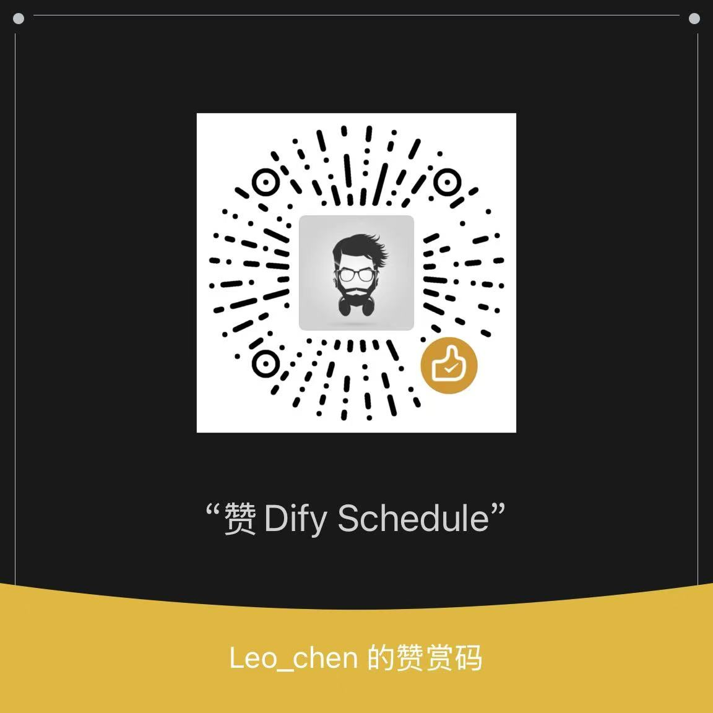

<section align="center">
  <a href="https://github.com/leochen-g/dify-schedule" target="_blank">
    
  </a>
</section>

<h1 align="center">Dify Workflow Scheduler</h1>

<p align="center">Since Dify doesn't have a built-in scheduling feature, executing workflow tasks on a schedule can be challenging. This project leverages GitHub Actions to run workflows daily and send notifications automatically.</p>

[中文文档](./README_CN.md)
[日本語](./README_JA.md)

## How to Use?
There are two ways to use automated workflows: Quick Start (Online) and Private Deployment (Local)

- Quick Start Automation: [Read Usage](#usage)
- Add Task to QingLong Panel: [Read QingLong Panel Usage](#qinglong-panel-usage)

## Usage

Automated Task Execution: Supports multiple Dify workflows.\
Automated Runtime: 06:30 AM Beijing Time

1. [Fork Repository](https://github.com/leochen-g/dify-schedule)

2. Repository -> Settings -> Secrets -> New repository secret, add the following Secrets:

   | Name | Value | Required |
   | --- | --- | --- |
   | DIFY_BASE_URL | Dify address. For private deployments, ensure public network accessibility. Defaults to https://api.dify.ai/v1 if not set | No |
   | DIFY_TOKENS | Dify workflow API keys. Required. Supports multiple keys separated by `;` | Yes |
   | DIFY_INPUTS | Variables required by Dify workflow. If you configured required inputs in Dify, this must be set in JSON format. Use an online JSON validator to verify | No |
   | EMAIL_USER | Sender's email address (SMTP must be enabled) | No |
   | EMAIL_PASS | Sender's email password (SMTP password) | No |
   | EMAIL_TO | Subscriber email addresses (recipients). For multiple subscribers, separate with `, `, e.g.: `a@163.com, b@qq.com` | No |
   | DINGDING_WEBHOOK | DingTalk robot WEBHOOK | No |
   | PUSHPLUS_TOKEN | Token from [Pushplus](http://www.pushplus.plus/) for WeChat message push | No |
   | SERVERPUSHKEY | Key from [ServerChan](https://sct.ftqq.com//) for WeChat message push | No |
   | WEIXIN_WEBHOOK | WeCom (Enterprise WeChat) robot WEBHOOK | No |
   | FEISHU_WEBHOOK | Feishu robot WEBHOOK | No |
   | AIBOTK_KEY | OpenAPI for WeChat sending. Register at [AI Secretary](https://wechat.aibotk.com?r=dBL0Bn&f=difySchedule), get apikey from personal center | No |
   | AIBOTK_ROOM_RECIVER | Group names for [Wechat Assistant](https://wechat.aibotk.com?r=dBL0Bn&f=difySchedule) messages | No |
   | AIBOTK_CONTACT_RECIVER | Contact nicknames for [Wechat Assistant](https://wechat.aibotk.com?r=dBL0Bn&f=difySchedule) messages | No |

4. Repository -> Actions, check and enable Workflows.

## Preview

| Dify Workflow Execution - wechat |  Dify Workflow Execution - email |
|:-----------:|:-----------:|
|  |  |

## QingLong Panel Usage

1. Add subscription in QingLong panel

```shell
ql repo https://github.com/leochen-g/dify-schedule.git "ql_" "utils" "sdk"
```

2. Add dependency `axios` in Panel Menu -> Dependency Management -> NodeJs

3. Add environment variables `DIFY_TOKENS` and `DIFY_BASE_URL`

In QingLong panel, add environment variables `DIFY_TOKENS` and `DIFY_BASE_URL`. Multiple workflow tokens are supported, separate them with `;` in DIFY_TOKENS

4. Uses QingLong's built-in notifications by default, configure as needed

## FAQ

### How to Get Dify Workflow Token

Open Dify website

> Must be a workflow application, other applications are not supported:


### Why Can't Access

If you have a private Dify deployment, ensure it's accessible via public network, otherwise it won't be accessible in GitHub workflows

### Execution Errors

1. First confirm if your application is a workflow application, as only workflow applications are supported

2. If there are required variable inputs, configure the `DIFY_INPUTS` environment variable in JSON format. Verify using an online JSON tool before entering

3. Carefully read error messages and troubleshoot accordingly, or raise issues with logs (remember to hide sensitive information)

## Contributing
 
You can submit any ideas as [Pull Requests](https://github.com/leochen-g/dify-schedule/pulls) or [GitHub Issues](https://github.com/leochen-g/dify-schedule/issues).

## Support
### ☕️WeChat Support!


## License

[MIT](./LICENSE)
